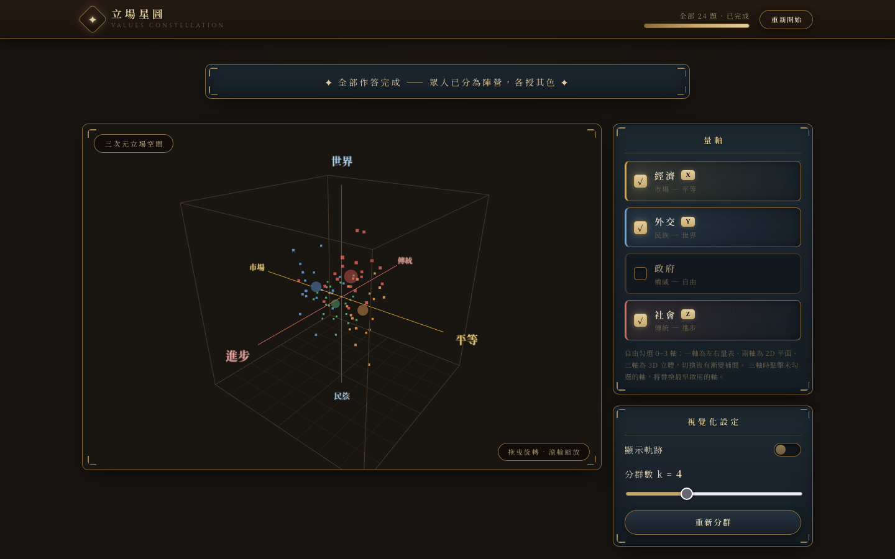
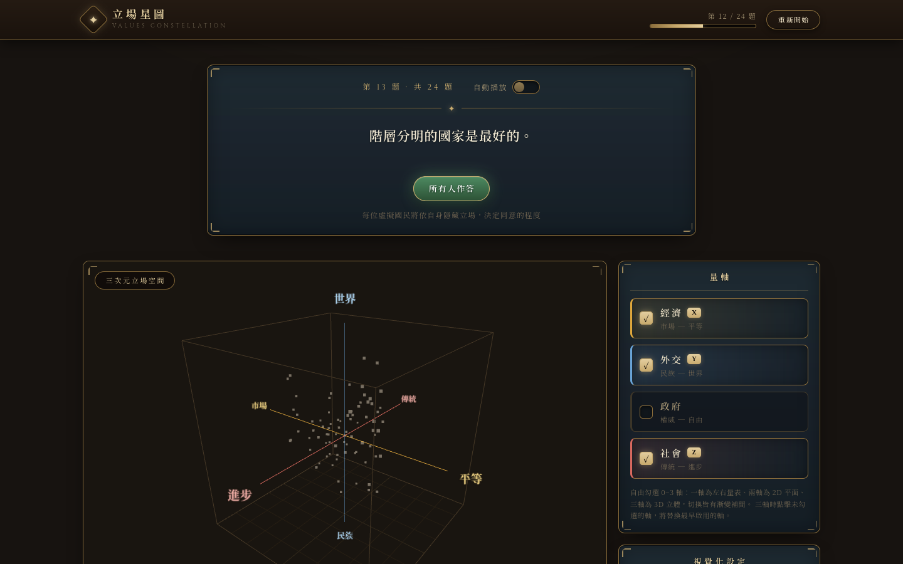
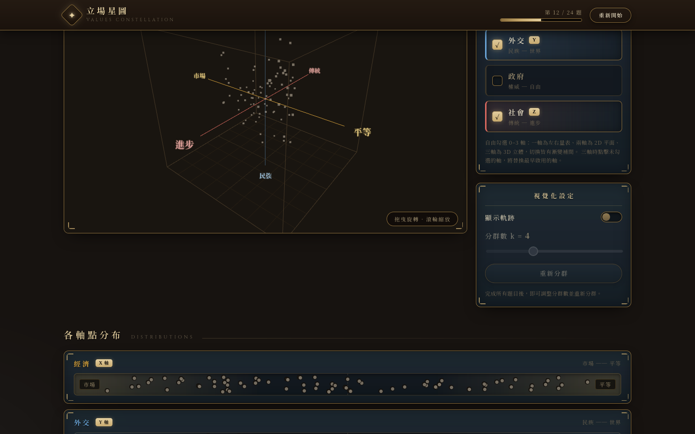
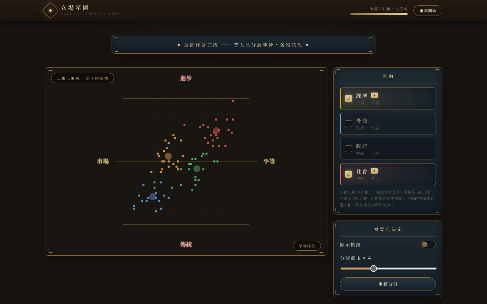
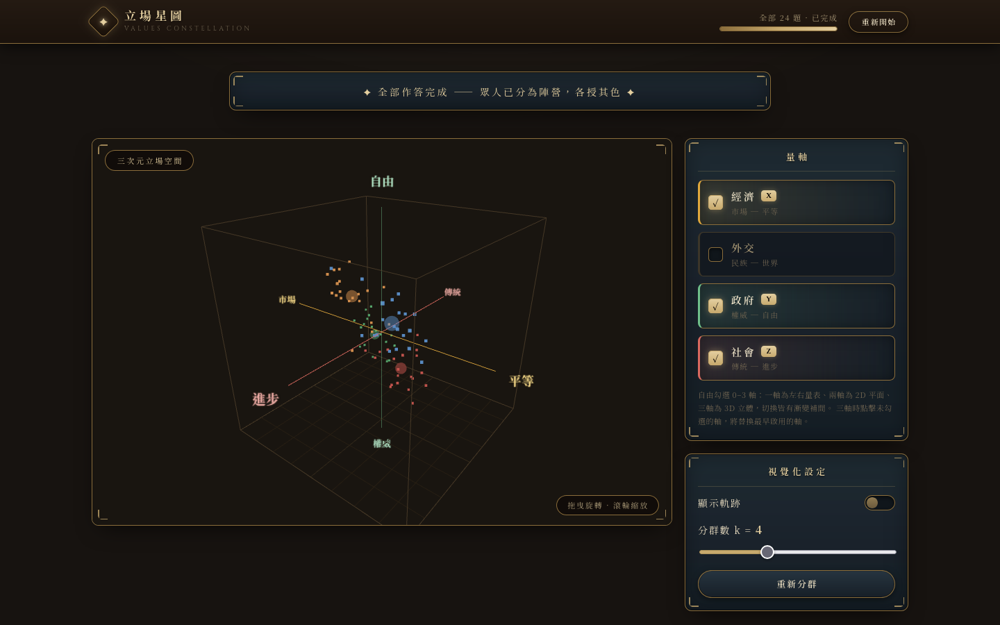
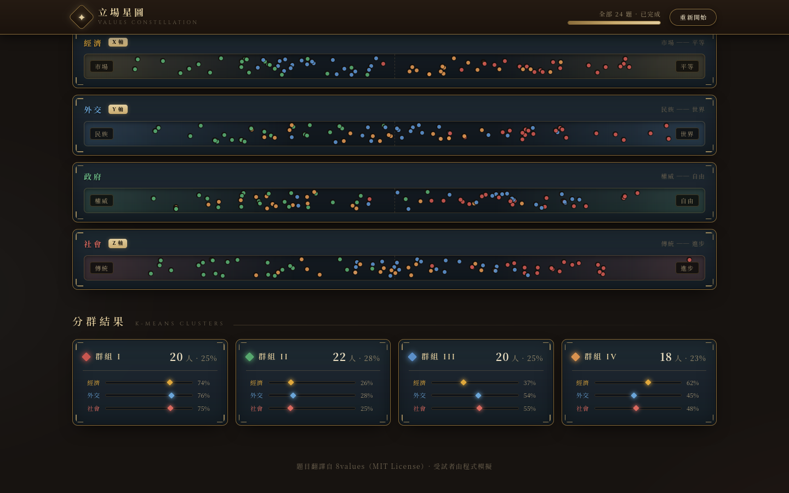

# 8values 3D 立場分群視覺化

以 8values 四軸政治立場光譜為基礎的**多人在 3D 空間中的即時漂移與 K-means 分群**視覺化。

 

## 畫面預覽

**K-means 分群完成後的 3D 立體圖（k = 4，各群授色）**



| 開始畫面 | 即時漂移（答題中） |
|---|---|
|  |  |
| **軌跡視覺化** | **二維正視圖（笛卡爾座標）** |
|  |  |
| **一維量表** | **各軸點分布** |
|  |  |

## 功能

- **3D 散點圖**：每位受試者是一個點，三個可切換的軸（經濟・外交・政府・社會四選三），支援拖曳旋轉、滾輪縮放（OrbitControls）
- **維度漸展（0–1–2–3）**：自由勾選 0–3 個量軸，星圖隨之展開／收合——
  0 軸＝空白（全員縮為中間點）→ 1 軸＝左右量表（點從中點左右展開、軸線自中心生長）→
  2 軸＝2D 笛卡爾平面（第二軸生長、金框平面展開、鏡頭轉正）→ 3 軸＝3D 立體。
  全部變換（鏡頭、軸生長、點位、場景換裝）皆以同一條 900ms ease-in-out 曲線同步補間
- **即時漂移動畫**：每答完一題，所有人的四軸分數變動，座標點以線性插值平滑移動到新位置
- **K-means 分群**：全部作答完成後自動分群（k-means++ 初始化 × 10 次重啟取最佳），各群標上顏色並顯示半透明群心球；分群基於目前顯示的座標（2D 模式即在平面上分群）
- **軌跡視覺化**：開關切換，顯示每個點從第一題到目前的完整移動路徑；2D 模式下軌跡同步壓平
- **互動調整**：分群數 k（2–8）即時重算、切換任兩三軸會在新空間重新分群、自動播放模式

## 快速開始

```bash
npm install
npm run dev      # 開發伺服器 http://localhost:5173
```

## 指令

| 指令                   | 說明                       |
| ---------------------- | -------------------------- |
| `npm run dev`          | 啟動開發伺服器             |
| `npm run build`        | 打包至 `dist/`             |
| `npm run preview`      | 預覽打包結果               |
| `npm run lint`         | ESLint 檢查                |
| `npm run format`       | Prettier 格式化            |
| `npm run format:check` | Prettier 格式檢查（CI 用） |

## 架構

```
src/
├── data/
│   ├── axes.js          # 四軸定義（名稱、兩極、顏色）、分群調色盤、羅馬數字
│   └── questions.js     # 70 題題庫（譯自 8values，含各軸 effect 權重）
├── sim/
│   ├── simulation.js    # 虛擬受試者生成、作答模擬、分數正規化、座標換算
│   └── kmeans.js        # K-means（k-means++ / 多重啟）與肘部法
├── components/
│   ├── HeaderBar.jsx        # 置頂列：品牌、進度、重新開始（sticky）
│   ├── SetupScreen.jsx      # Hero 開始區：人數 / 題數設定
│   ├── QuestionCard.jsx     # 題目卡與作答推進、自動播放
│   ├── Scene3D.jsx          # Three.js 場景：散點、軸線標籤、軌跡、群心、動畫迴圈、2D⇄3D 轉換
│   ├── AxisRail.jsx         # 右欄：量軸勾選卡（2–3 軸 / FIFO 替換 / 槽位輪換）+ 視覺化設定
│   ├── DistributionStrip.jsx# 各軸點分布條（beeswarm，分群連動著色）
│   ├── ClusterSection.jsx   # 分群結果卡片網格（羅馬數字徽記、重心條）
│   └── SectionTitle.jsx     # 章節標題（飾帶分隔線）
├── App.jsx              # 頁面組裝與流程狀態機（setup → quiz → done）
└── main.jsx
```

頁面為可滑動的一般網頁：置頂列 → 題目卡 → 3D 主視覺（左）+ 量軸欄（右）→
各軸點分布 → 分群結果 → 頁尾。視覺風格參考《文明帝國 VI》UI：
暖黑棕底、深青藍面板、金色雕飾邊框、羊皮紙襯線字（Cinzel + Noto Serif TC）。

### 資料模型

- 每位虛擬受試者有隱藏立場向量 `bias ∈ [-1,1]^4`（約 75% 圍繞 5 種意識形態種子的高斯分佈、25% 均勻隨機雜訊）
- 作答時，契合度 = 題目 effect 向量與 bias 的加權內積 + 高斯雜訊，映射到五級作答強度 `m ∈ {-2,…,+2}`
- 分數 `score[ax] += effect[ax] × m`；顯示位置 = `50 + 50 × score / 該步最大可能 |score|`（8values 正規化法的逐步版），確保點永遠落在立方體內
- 每一步的歷史分數完整保留在 `agent.history`，軌跡與座標換算都由此推導（換軸不需重跑模擬）

## 授權與出處

- 題目翻譯自 [8values](https://github.com/8values/8values.github.io)（MIT License）
- 其餘程式碼屬於本專案團隊
